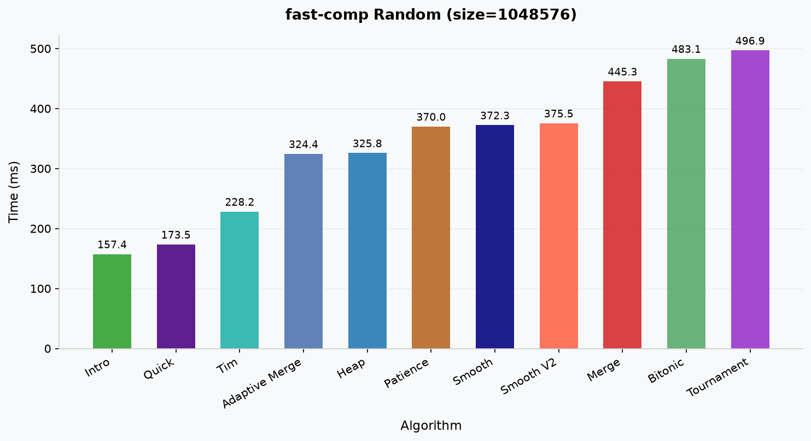
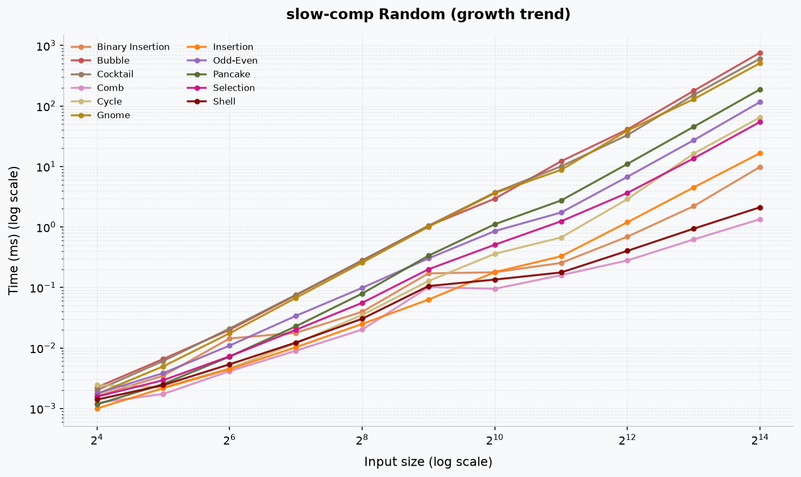

# Benckmarks

This section describes how to build, run, and visualize the benchmark suite for sorting algorithms.

## Requirements
- CMake ≥ 3.20
- C++23 compatible compiler
- Python 3.12+

You can verify your CMake version with:
```bash
$ cmake --version
# cmake X.X.X
```

## Build Instructions
Configure and build the project using CMake:
```bash
$ cmake -S . -B build
$ cmake --build build
```

## Running Benchmarks
After a successful build, execute the benchmark binaries:
```bash
$ ./build/bench_fast   # Fast comparison-based sorting algorithms
$ ./build/bench_slow   # Slow comparison-based sorting algorithms
$ ./build/bench_non    # Non-comparison sorting algorithms
```

## Output Files
Benchmark results will be generated in `benchmarks/results/`.  
The following CSV files will be produced:
- `fast-comparison.csv`
- `slow-comparison.csv`
- `non-comparison.csv`

Each file contains performance data for the corresponding algorithm category.

## Visualization
To generate plots from benchmark results, Python dependencies must be installed first.

1. **Create virtual environment**:
    ```bash
    $ python3 -m venv .venv
    $ source .venv/bin/activate
    ```
    
2. **Install dependencies**:

    ```bash
    $ pip install -r requirements.txt
    ```

3. **Run the plotting script**:

    ```bash
    $ python ./benchmarks/plot.py

    # Parameters 
    #     --comp      Optional. Comparison type. 
    #     --size      Optional. Input size to plot. 
    #     --mode      Optional. Chart mode to generate. 
    # Accepted values and defaults 
    #     --comp      ["fast", "slow", "non", "all"]    Default: all 
    #     --size      Integer                           Default: Maximum size in dataset
    #     --mode      ["bar", "trend", "both"]          Default: both
    ```

    ### Example: 

    ```bash
    $ python ./benchmarks/plot.py --comp fast --size 131072 --mode both
    ```

## Output Images
Generated plots will be saved to `benchmarks/images/`.

  
  